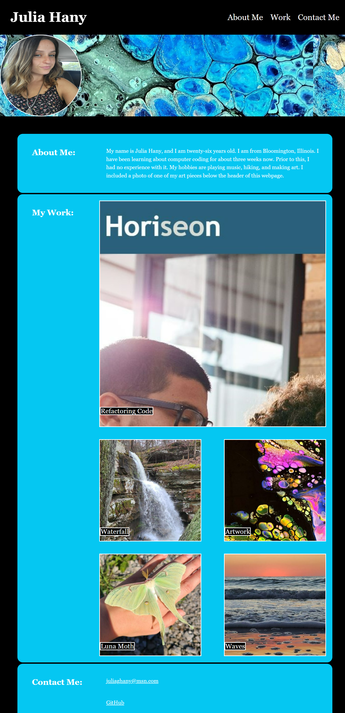

# Julia Hany's Portfolio

## Description 

- My motivation for this project was to learn how to create an HTML and CSS document from scratch. 
- I built this project (a professional portfolio) so that potential employers can view my previous work. I also built this project to gain more experience working with HTML and CSS documents.
- Creating this portfolio eliminates the problem of not having all of my work in one place for potential employers to review. Now that I have created this, anyone who is possibly interested in hiring me will have a webpage they can visit to see what I am capable of. 
- I learned that in order to reset the CSS for this project, I had to link the CSS reset style sheet before I linked my CSS style sheet, otherwise the reset would override the styles that I applied to my website. I learned how to use ID selectors to make my navigation bar function properly, and I used challenge 1 as an example to accomplish this. I also learned how to add a functioning link to an image when I connected a link to my first project to an image of our challenge 1 assignment, as well as how to add a title to an image using the text element and specific positioning values.  I learned how to remove the underline and change the color of the links in my navigation bar, and change the color of the contact information, in order to achieve the look that I wanted for my portfolio. I learned how to add functioning links to the email address I listed in the "contact me" section, as well as the link to my GitHub account so that employers can review the code and README files for my previous work. 
- I included a lot of comments to explain what I was doing in my CSS document and why I was doing it. If this is something we shouldn't make a habit of, please let me know me in the feedback. 

## Usage 

- To use this webpage, you can click on any of the links in the navigation bar, and you will be directed to the section that you selected. There, you can review information regarding the section of the webpage that you clicked on. If you'd like to be taken to the deployed action of my work, you can simply click on the images showcased in the section "my work" and it will take you to that webpage. For now, I've only finished one project, so only one of the images will take you to a deployed action. If you'd like to contact me via email, you can click on the email that I provided in the "contact me" section to easily do so. You can also click on the GitHub link to review the code and README file for my previous projects. 

## Credits 

- I referenced the HTML document in challenge 1 to add ID selectors to my navigation bar so that it would function properly.
 I used information from this webpage to remove the underline from the links in my navigation bar:  https://www.scaler.com/topics/how-do-you-display-hyperlinks-without-an-underline/
- I used information from this webpage to make the image of my work a clickable link that takes users to the deployed action: https://na01.safelinks.protection.outlook.com/?url=https%3A%2F%2Ftestbook.com%2Fweb-development%2Fhow-to-make-an-image-clickable-in-html%23%3A~%3Atext%3DHow%2520To%2520Create%2520A%2520Clickable%2520Image%2520In%2520HTML%253F%2Ca%253E%2520tag%2520along%2520with%2520it&data=05%7C01%7C%7C5c06fc34e63044fd87b208db052c3a3e%7C84df9e7fe9f640afb435aaaaaaaaaaaa%7C1%7C0%7C638109459744106189%7CUnknown%7CTWFpbGZsb3d8eyJWIjoiMC4wLjAwMDAiLCJQIjoiV2luMzIiLCJBTiI6Ik1haWwiLCJXVCI6Mn0%3D%7C3000%7C%7C%7C&sdata=DFU81%2BCkD2zW1qZw8A9eI3vTNDtDVsPF8v1QTnUYHgw%3D&reserved=0
- I used this website to pull a specific color from the image between the header and body of my website, which I then used as a backdrop in the main section of my webpage: https://color.adobe.com/create/image
- I used information in this website to change the opacity of the images in the "my work" section when you hover over it: https://www.w3schools.com/css/css_image_transparency.asp
- My tutor, Alexis Gonzalez, helped me add and understand media queries to make my webpage responsive, which allowed my webpage to be visually appealing regardless of the size of the screen it was being viewed on. He also helped me understand the relationship between parent and child elements so that I could target certain sections in my document to make the elements behave the way I wanted them to. He helped me add a backdrop to my sections so that I could add some more color to my portfolio. He also showed me how to add the placeholder images and position them in a way that was similar to the mock-up. 
- I used the reset.css file from activity 12 in the module 2 activities as my reset.css file. 

[def]: _C__Users_julia_OneDrive_Documents_bootcamp_challenge-2_index.html.png